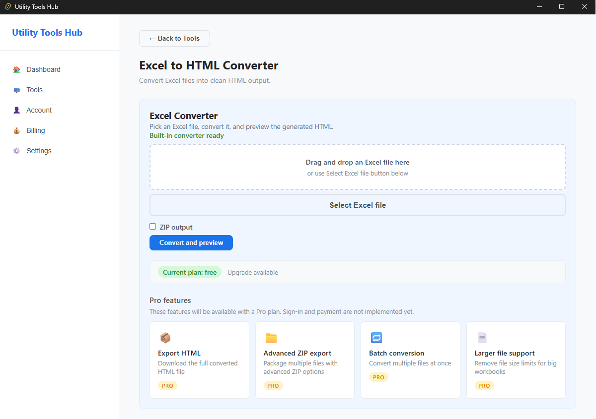
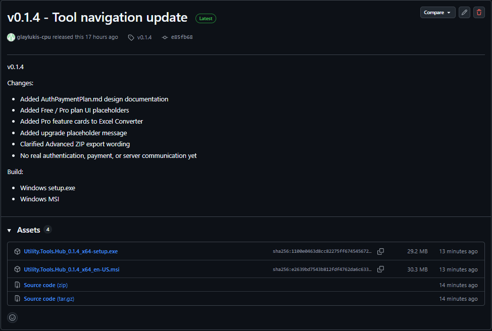

# Utility Tools Hub

A desktop hub for small, local-first productivity tools.

- **Official website:** [Utility Tools Hub](https://glaylukis-cpu.github.io/utility-tools-hub-site/)
- **Latest release:** [v0.3.1](https://github.com/glaylukis-cpu/utility-tools-hub/releases/tag/v0.3.1)

## Current Status

- Latest release: v0.3.1
- Windows desktop app
- Excel to HTML Converter is available
- The Tools catalog is organized into Converters, Editors, and Planned / Pro tools
- Converter Tools stacks File, Data, and Text converter sections, with each active editor shown inside its category
- Text Case Converter navigation and Excel → HTML Converter navigation are maintained
- PDF Tools provides local Merge PDFs, Split PDF, and Extract pages MVPs with success, error, and loading states
- PDF page operations use the local Rust core without a Python sidecar or external communication
- Rotate, delete, and reorder remain planned; direct PDF text editing, OCR, and redaction are not implemented
- Billing shows a pricing model draft, and Account shows a planned license activation flow
- Real authentication, payment, Stripe Checkout, Customer Portal, license activation, Pro unlock, and external communication are not implemented yet

## Features

### Excel to HTML Converter

- Built-in converter sidecar
- No external converter folder required
- Select `.xlsx` files
- Drag and drop `.xlsx` files
- Convert and preview generated HTML
- Sheet tab switching in preview
- Optional ZIP output for current single-file conversion

### Free / Pro UI Placeholder

- Free plan indicator
- Pro feature cards
- Upgrade placeholder message
- No real login, payment, or server communication yet

## Screenshots

## Download

Download the latest Windows installer from [GitHub Releases](https://github.com/glaylukis-cpu/utility-tools-hub/releases).

- **For most Windows users**: download the `setup.exe` installer
- MSI package is also available for Windows installer workflows

## Install

**Windows:**

1. Download the latest `setup.exe` from [GitHub Releases](https://github.com/glaylukis-cpu/utility-tools-hub/releases)
2. Run the installer
3. Launch **Utility Tools Hub**
4. Open **Tools -> Excel to HTML Converter**

## Usage

**Excel Converter:**

1. Open **Tools**
2. Open **Excel to HTML Converter**
3. Select or drag and drop an `.xlsx` file
4. Click **Convert and Preview**
5. Review the generated HTML preview
6. Use sheet tabs inside the preview when available

## Release Notes

### v0.1.4

- Added auth/payment planning documentation
- Added Free / Pro UI placeholders
- Added Pro feature cards
- Clarified Advanced ZIP export wording

### v0.1.3

- Bundled Excel Converter sidecar
- Removed external converter folder requirement from normal user flow
- Confirmed conversion preview and sheet tab switching

### v0.1.2

- Added Excel Converter entry flow inside the hub
- Improved file selection and drag/drop UX

## Development Notes

- Tauri + React desktop app
- Python-based Excel converter bundled as a Tauri sidecar
- Windows release builds generate `setup.exe` and MSI
- Auth/payment is planned but not implemented

## Documentation

- [Auth Payment Plan](Docs/AuthPaymentPlan.md)
